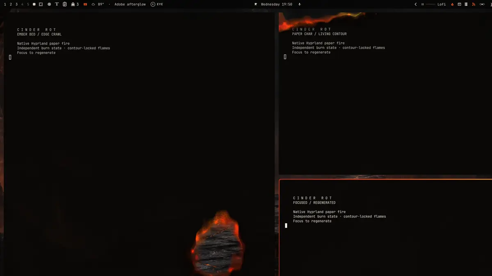
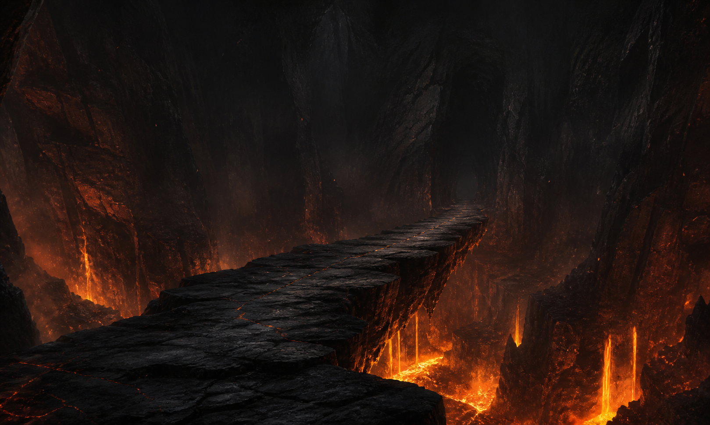
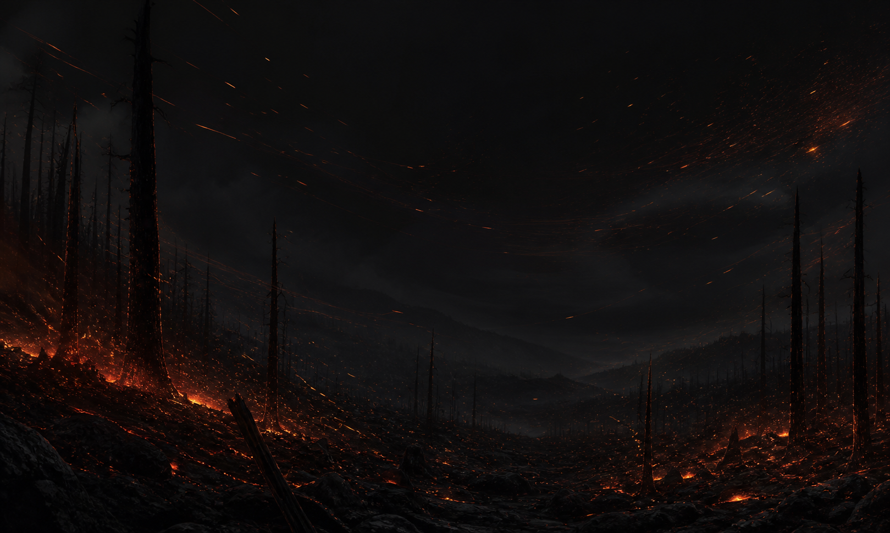
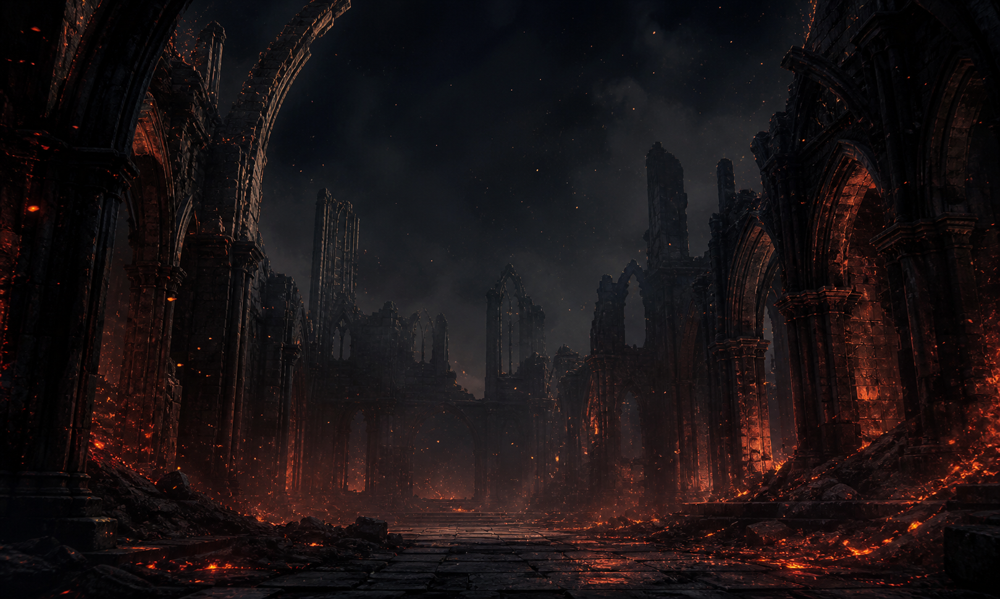

# Cinder Rot

Cinder Rot is a soot-black Omarchy theme with ember-orange accents, warm
terminal colors, and three fire-lit backgrounds.



## Install

Install and apply the theme through Omarchy:

```bash
omarchy theme install https://github.com/majesticio/omarchy-cinder-rot-theme.git
```

You can also paste that URL into **Install > Style > Theme** in the Omarchy
menu.

Cycle the included backgrounds with:

```bash
omarchy theme bg next
```

## Included

- a complete Omarchy `colors.toml` palette;
- Omarchy Shell, btop, Chromium, icon, and keyboard colors;
- volcanic bridge, windblown ember, and ruined cathedral backgrounds;
- matching unlock artwork.

The bundled backgrounds were generated specifically for this project. Their
source descriptions are preserved in [ARTWORK.md](ARTWORK.md).

The repository intentionally contains only theme data. Omarchy safely
regenerates terminal, editor, and Hyprland color configuration from
`colors.toml` when installing a community theme.

## Optional burning-window effect

The animated paper fire shown above is provided by the separate
[Cinder Rot native Hyprland effect](https://github.com/majesticio/cinder-rot).
The visual theme works without it; the procedural flames do not.

The effect is kept separate because Hyprland plugins must be compiled against
the exact compositor version running on the machine. Follow its own build,
compatibility, safety, and removal instructions before loading it.

## Backgrounds

| Volcanic bridge | Windblown embers | Cathedral ruins |
| --- | --- | --- |
|  |  |  |

## Remove

Switch to another theme before removing Cinder Rot:

```bash
omarchy theme set tokyo-night
omarchy theme remove cinder-rot
```

Removing the theme does not remove the optional native effect. Its repository
contains separate uninstall instructions.

## Compatibility

Validated with Omarchy 4.0.2. Community theme installation removes executable
theme files and regenerates supported application configuration from the
palette, so this repository does not depend on a theme-provided startup hook.

## License

Cinder Rot's palette, theme files, and bundled artwork are licensed under the
[GNU General Public License v3.0 or later](LICENSE).
